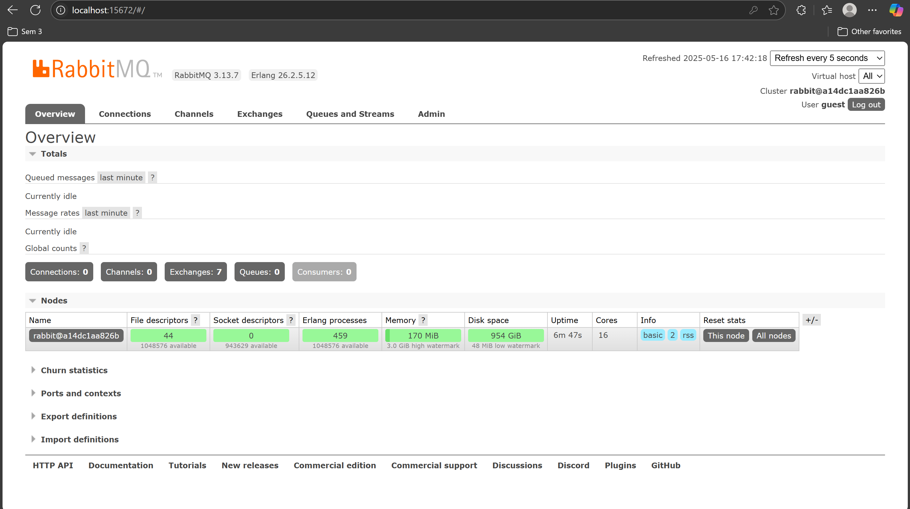
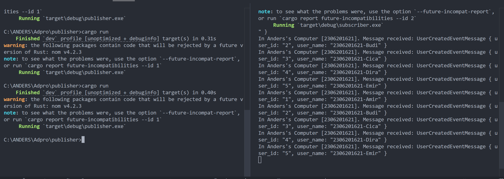

# Tutorial 9 (Publisher)

a. The program sends exactly 5 messages to the message broker. Each message is a UserCreatedEventMessage struct containing user_id and user_name.

b. It means both programs are connecting to the same RabbitMQ message broker instance. It's essential that they use the same connection details because they need to communicate through the same message broker. The publisher sends messages to this broker and the subscriber receives messages from it. Using the same connection URL ensures both programs are working with the same message broker instance. If these URLs were different, the programs would be attempting to connect to different message brokers and the communication would fail.

## Running RabbitMQ as message broker

## Sending and processing event

The terminals demonstrate successful event-driven communication. The left terminal shows the publisher executing, while the right terminal displays the subscriber receiving 5 user creation messages. Each message contains a user ID and name, confirming that the data was successfully transmitted from publisher to subscriber through the RabbitMQ message broker.

## Monitoring chart based on publisher

