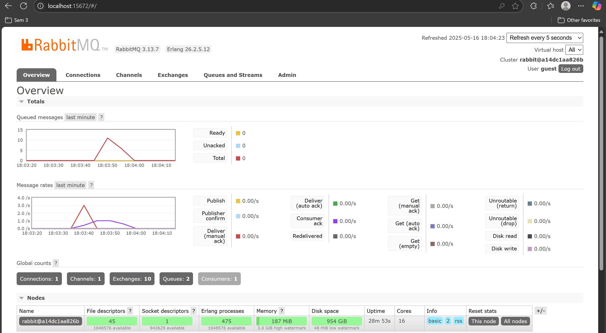
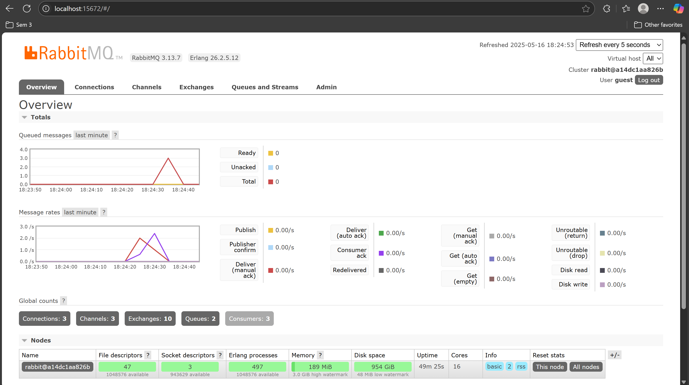

# Tutorial 9 (Publisher)

a. The program sends exactly 5 messages to the message broker. Each message is a UserCreatedEventMessage struct containing user_id and user_name.

b. It means both programs are connecting to the same RabbitMQ message broker instance. It's essential that they use the same connection details because they need to communicate through the same message broker. The publisher sends messages to this broker and the subscriber receives messages from it. Using the same connection URL ensures both programs are working with the same message broker instance. If these URLs were different, the programs would be attempting to connect to different message brokers and the communication would fail.

## Running RabbitMQ as message broker

## Sending and processing event

The terminals demonstrate successful event-driven communication. The left terminal shows the publisher executing, while the right terminal displays the subscriber receiving 5 user creation messages. Each message contains a user ID and name, confirming that the data was successfully transmitted from publisher to subscriber through the RabbitMQ message broker.

## Monitoring chart based on publisher

## Simulation slow subscriber

The total number of queue depends on how many times we run `cargo run`. In the example, the publisher ran 5 times, sending 25 messages in total. Out of this, 5 messages are being processed, and 20 messages remain in the queue. That's why the number of queue is 20. In my case, the number of queue is 10 because I ran the publisher 3 times, sending 15 messages in total. Out of this, 5 messages are being processed, and 10 messages remain in the queue.

## Running at least three subscribers

When multiple subscribers are connected to the same queue in an event-driven architecture, the workload is distributed among them, allowing messages to be processed concurrently and more efficiently. By spawning multiple subscriber instances, the queue's size reduces faster because RabbitMQ splits the messages among the connected subscribers in a round-robin fashion.

There are several potential improvements that could be made. The publisher could benefit from batch publishing capabilities, better error handling, retry mechanisms, and message prioritization. The subscriber code could be enhanced with graceful shutdown mechanisms, improved error recovery, and configurable concurrency limits.